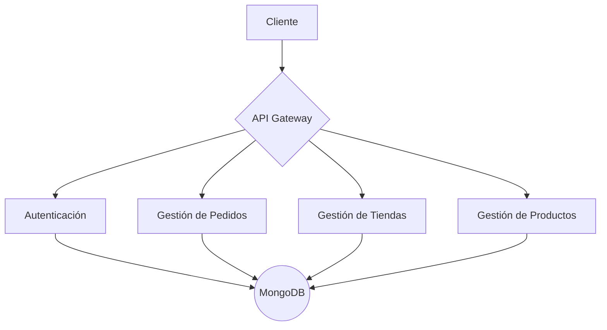

# YEGA Backend


Bienvenido al backend de **YEGA**, una API construida con Node.js, Express y MongoDB para soportar las funcionalidades principales de la aplicación.

## Arquitectura

A continuación se muestra un diagrama de la arquitectura del backend:



## 📦 Instalación
1. Clona el repositorio:
   ```bash
   git clone <URL-del-repo>
   cd yega-app/backend
   ```
2. Instala las dependencias:
   ```bash
   npm install
   ```

## ⚙️ Configuración del entorno
1. Crea un archivo `.env` en la raíz del directorio `backend`.
2. Define las variables necesarias:
   ```env
   PORT=5000
   MONGODB_URI=<tu_cadena_de_conexion>
   FRONTEND_URL=http://localhost:3000
   RATE_LIMIT_WINDOW_MS=900000
   RATE_LIMIT_MAX_REQUESTS=500
   ENABLE_HSTS=false
   ```

## 🚀 Despliegue
1. Asegúrate de que las variables de entorno estén configuradas correctamente.
2. Inicia el servidor en modo producción:
   ```bash
   npm start
   ```
3. Accede a `http://localhost:5000` para verificar que el backend esté funcionando.

## API Endpoints

El backend expone los siguientes endpoints principales:

-   **Autenticación**: `/api/auth` - Maneja el registro, inicio de sesión y gestión de usuarios.
-   **Tiendas**: `/api/stores` - Permite la creación y gestión de tiendas.
-   **Productos**: `/api/products` - Maneja el CRUD de productos para las tiendas.
-   **Pedidos**: `/api/orders` - Gestiona el ciclo de vida de los pedidos.
-   **Geocodificación**: `/api/geocoding` - Provee servicios de geolocalización.

---
Sebastian Vernis | Soluciones Digitales
