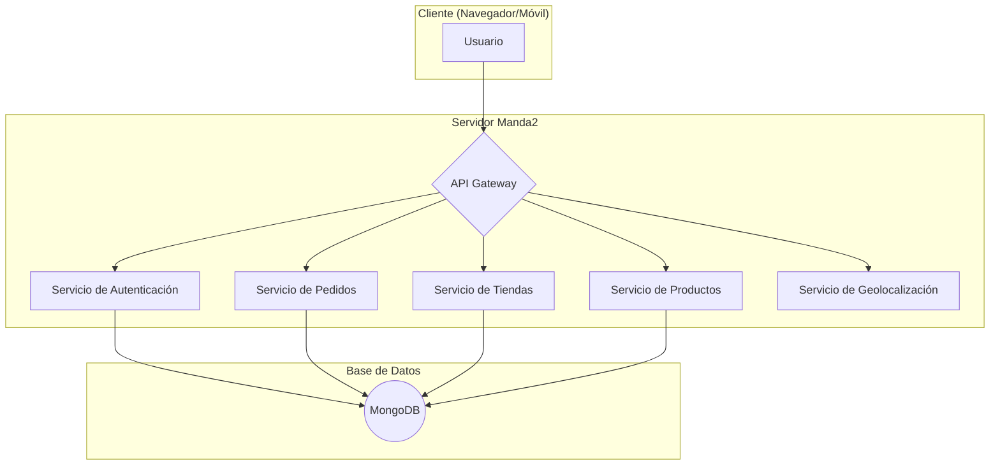
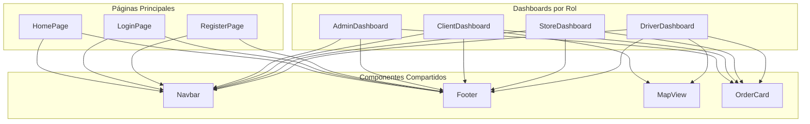
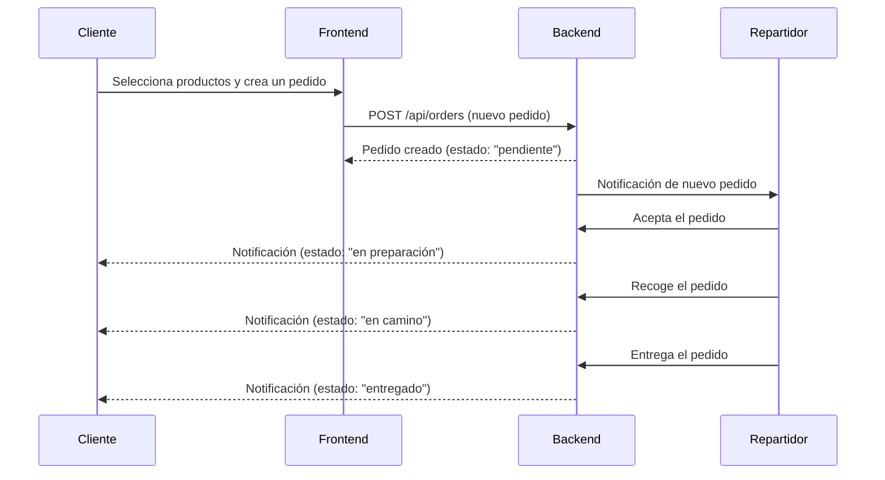

# Documentación del Proyecto Manda2

Este documento proporciona una descripción detallada de la arquitectura, funcionalidades y componentes del proyecto Manda2.

## 1. Visión General

Manda2 es una plataforma de delivery diseñada para conectar clientes, tiendas y repartidores de manera eficiente. La solución se compone de un backend robusto que gestiona la lógica de negocio y una aplicación frontend moderna y reactiva para la interacción del usuario.

## 2. Arquitectura del Backend

El backend está construido con Node.js y Express, y utiliza MongoDB como base de datos. A continuación se detalla su arquitectura.

### Diagrama de Arquitectura

### Modelos de la Base de Datos

-   **Usuario**: Almacena información sobre los usuarios (clientes, dueños de tiendas, repartidores), incluyendo datos de autenticación y roles.
-   **Tienda**: Contiene detalles sobre los comercios registrados, como nombre, ubicación y productos.
-   **Producto**: Describe los artículos que una tienda ofrece.
-   **Pedido**: Gestiona el ciclo de vida de un pedido, desde su creación hasta la entrega.
-   **OTP**: Maneja los códigos de verificación para la autenticación de dos factores.

## 3. Arquitectura del Frontend

El frontend es una Single Page Application (SPA) desarrollada con React y Vite.

### Diagrama de Componentes

## 4. Flujo de un Pedido

---
Sebastian Vernis | Soluciones Digitales
