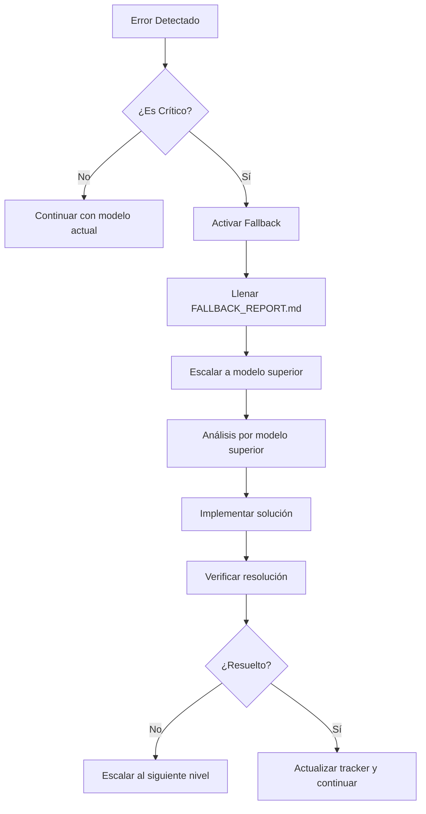

# Sistema de Fallback para Errores Críticos - Manda2

## 🚨 Protocolo de Escalación de Errores

### Jerarquía de Modelos por Capacidad (Basado en modelos_list.csv)
```yaml
Nivel 1 (Máxima Capacidad - Modelos Principales):
  - Claude 3.5 Sonnet (Arquitectura, Security, Performance, PWA)
  - GPT-4 Turbo (Testing Funcional, E2E, Integration)
  
Nivel 2 (Alta Capacidad - Fallback Inmediato):
  - Claude 3.5 Sonnet (Backup para GPT-4 Turbo tasks)
  - GPT-4 Turbo (Backup para Claude 3.5 Sonnet tasks)
  
Nivel 3 (Capacidad Estándar - Fallback Externo):
  - Gemini Pro 1.5 (Google)
  - Claude 3 Haiku (Anthropic)
  - GPT-4 (OpenAI)
  
Nivel 4 (Fallback de Emergencia):
  - Qwen2.5 Coder 32B (Local)
  - Codestral (Local)
  - DeepSeek Coder (Local si disponible)
```

## 🔄 Protocolo de Escalación

### Cuando Activar Fallback
```yaml
Errores Críticos:
  - Build failures persistentes (>3 intentos)
  - Componentes que no renderizan
  - APIs que no conectan
  - Errores de sintaxis no resueltos
  - Pérdida de funcionalidad existente
  - Corruption de archivos importantes
  
Errores No Críticos:
  - Warnings de linting
  - Optimizaciones de performance menores
  - Mejoras de UX no esenciales
  - Documentación incompleta
```

### Proceso de Escalación


## 📋 Activación Automática del Fallback

### Triggers Automáticos
```yaml
Build Failure:
  - npm run build retorna código de salida != 0
  - Errores de TypeScript/ESLint críticos
  - Missing dependencies no resueltas
  
Runtime Errors:
  - Componente retorna error en render
  - API calls fallan consistentemente
  - Routing breaks
  
Code Corruption:
  - Archivos con sintaxis inválida
  - Import/export paths rotos
  - Estado global corrupto
```

### Script de Detección
```bash
#!/bin/bash
# auto_fallback_detect.sh

# Check build status
cd frontend
if ! npm run build > /dev/null 2>&1; then
    echo "🚨 CRITICAL: Build failed - Activating fallback"
    echo "BUILD_FAILURE" > ../FALLBACK_TRIGGER.flag
    exit 1
fi

# Check for critical errors in logs
if grep -q "TypeError\|ReferenceError\|Cannot read property" logs/*.log 2>/dev/null; then
    echo "🚨 CRITICAL: Runtime errors detected - Activating fallback"
    echo "RUNTIME_ERROR" > ../FALLBACK_TRIGGER.flag
    exit 1
fi

# Check API connectivity
if ! curl -s http://localhost:5000/api/health > /dev/null; then
    echo "🚨 CRITICAL: Backend API unreachable - Activating fallback"
    echo "API_FAILURE" > ../FALLBACK_TRIGGER.flag
    exit 1
fi

echo "✅ System status: Healthy"
exit 0
```

## 🛠️ Resolución por Nivel

### Nivel 1: Claude 3.5 Sonnet (Tareas Principales según CSV)
**Especializaciones según modelos_list.csv:**
- Repartidor/Pedidos.jsx ($150-250)
- Cliente/Dashboard.jsx ($100-150)
- Gradientes y Visual Consistency ($95-155 total)
- Security Audit ($30-50)
- Performance Optimization ($40-60)
- PWA Features ($50-80)
- Documentation ($30-50)

**Capacidades de Fallback:**
- Análisis arquitectural completo
- Debugging de WebSocket y geolocation
- Refactoring de componentes complejos
- Security y performance issues

### Nivel 1: GPT-4 Turbo (Testing Specialist según CSV)
**Especializaciones según modelos_list.csv:**
- Testing Funcional ($40-70)
- E2E Testing con Playwright
- Performance Testing
- Integration Testing

**Capacidades de Fallback:**
- Test suite debugging
- API integration issues
- Build pipeline problems
- Testing framework configuration

### Nivel 2: Fallback Cruzado (Claude ↔ GPT-4)
**Claude 3.5 Sonnet como Fallback para GPT-4 Turbo:**
- Testing issues que requieren architectural insight
- E2E test failures relacionados con componentes
- Performance testing con optimization needs
- Integration testing con component refactoring

**GPT-4 Turbo como Fallback para Claude 3.5 Sonnet:**
- Component issues que requieren testing perspective
- Architecture problems detectados via testing
- Performance issues que necesitan test validation
- Security issues que requieren test coverage

### Nivel 3: Fallback Externo (Cuando Principales Fallan)
**Gemini Pro 1.5:**
- Code analysis y pattern recognition
- Component debugging
- API integration fixes
- Build configuration issues

**Claude 3 Haiku:**
- Simple syntax corrections
- Basic component fixes
- Linting error resolution
- Import/export fixes

**GPT-4 (Standard):**
- General debugging
- Documentation fixes
- Configuration adjustments
- Basic refactoring

### Nivel 4: Local Models (Emergency Only)
**Capacidades:**
- Basic code analysis
- Simple pattern matching
- Emergency documentation
- Basic file operations

**Uso:**
- Solo cuando servicios externos fallan
- Emergency rollback operations
- Basic system recovery
- Local-only debugging

## 📊 Sistema de Métricas de Fallback

### Tracking de Escalaciones
```yaml
Total Fallbacks: 0
Success Rate by Level:
  Nivel 1: 0/0 (0%)
  Nivel 2: 0/0 (0%) 
  Nivel 3: 0/0 (0%)
  Nivel 4: 0/0 (0%)

Most Common Errors:
  - BUILD_FAILURE: 0
  - RUNTIME_ERROR: 0
  - API_FAILURE: 0
  - CODE_CORRUPTION: 0

Average Resolution Time:
  Nivel 1: 0 min
  Nivel 2: 0 min
  Nivel 3: 0 min
  Nivel 4: 0 min
```

## 🔧 Recovery Procedures

### Post-Fallback Recovery
```yaml
Immediate Actions:
  1. Verify system stability
  2. Run full test suite
  3. Check all critical paths
  4. Update session tracker
  5. Document lessons learned

Long-term Actions:
  1. Identify root cause
  2. Implement preventive measures
  3. Update error detection
  4. Improve fallback triggers
  5. Review escalation efficiency
```

### Emergency Rollback
```bash
# Emergency rollback script
#!/bin/bash
echo "🚨 EMERGENCY ROLLBACK INITIATED"

# Get last known good commit
LAST_GOOD=$(git log --oneline | grep "✅ COMPLETADA" | head -1 | cut -d' ' -f1)

if [ -n "$LAST_GOOD" ]; then
    echo "Rolling back to: $LAST_GOOD"
    git reset --hard $LAST_GOOD
    cd frontend && npm install && npm run build
    cd ../backend && npm install && npm test
    echo "✅ Rollback completed to last stable state"
else
    echo "❌ No stable commit found - Manual intervention required"
fi
```

## 🎯 Integration con Session Tracker

### Auto-Update Session Status
```yaml
En caso de Fallback:
  Current Session Status: "❌ ERROR - Fallback Activado"
  Fallback Level: "[Nivel X]"
  Error Type: "[BUILD_FAILURE|RUNTIME_ERROR|API_FAILURE|CODE_CORRUPTION]"
  Resolution Model: "[Modelo utilizado]"
  Resolution Time: "[Minutos]"
  
Post-Resolution:
  Session Status: "🔄 EN PROGRESO - Recuperado de Fallback"
  Next Actions: "[Próximos pasos definidos por modelo superior]"
```

---

**Sistema de Fallback Activado:** ✅  
**Monitoring:** 24/7 Automático  
**Escalación:** Basada en severidad  
**Recovery:** Automático con verificación manual