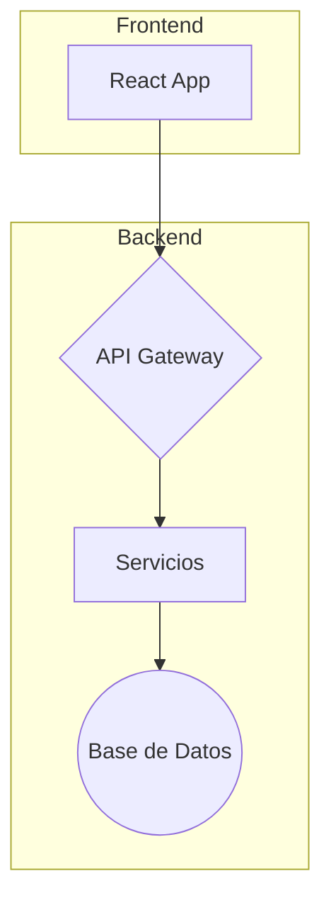

# Manda2 - Aplicación de Delivery

**Manda2** es una aplicación de delivery completa que conecta a clientes, tiendas y repartidores. La plataforma consta de un backend robusto y un frontend moderno y reactivo.

## Arquitectura General

## Módulos del Proyecto

Este repositorio está organizado en dos módulos principales:

-   **Backend**: Contiene la API REST, la lógica de negocio y la integración con la base de datos. Para más detalles, consulta el [README del Backend](./backend/README.md).
-   **Frontend**: Incluye la aplicación web de cara al cliente, construida con React. Para más información, visita el [README del Frontend](./frontend/README.md).

## 🚀 Cómo Empezar

Para poner en marcha el proyecto, sigue las instrucciones de instalación y configuración en los README de cada módulo.

## 📄 Documentación Adicional

Para una visión más detallada de la arquitectura, funcionalidades y decisiones de diseño, consulta el archivo [DOCUMENTATION.md](./DOCUMENTATION.md).

---
Sebastian Vernis | Soluciones Digitales
