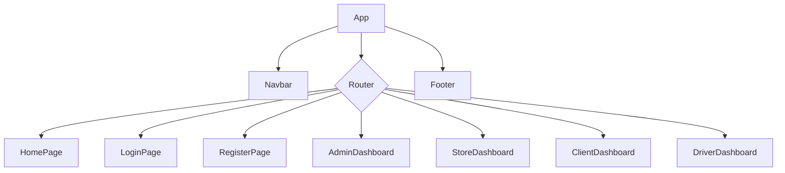

# YEGA Frontend


Bienvenido al frontend de **YEGA**, una aplicación web construida con React y Vite para proporcionar una interfaz de usuario moderna y reactiva.

## Arquitectura de Componentes

A continuación se muestra un diagrama de la jerarquía de componentes del frontend:



## 📦 Instalación y Desarrollo

1.  **Clonar el repositorio**:
    ```bash
    git clone <URL-del-repo>
    cd yega-app/frontend
    ```
2.  **Instalar dependencias**:
    ```bash
    npm install
    ```
3.  **Iniciar el servidor de desarrollo**:
    ```bash
    npm run dev
    ```
    La aplicación estará disponible en `http://localhost:3000`.

## ⚙️ Scripts Disponibles

-   `npm run dev`: Inicia el servidor de desarrollo con Vite.
-   `npm run build`: Compila la aplicación para producción en el directorio `dist/`.
-   `npm run preview`: Previsualiza la compilación de producción localmente.
-   `npm run lint`: Ejecuta ESLint para verificar el estilo del código.

## 📁 Estructura del Proyecto

-   `src/pages`: Contiene las vistas principales de la aplicación, organizadas por rol.
-   `src/components`: Componentes reutilizables de la interfaz de usuario.
-   `src/services`: Lógica de cliente para interactuar con la API del backend.
-   `src/context`: Proveedores de contexto de React para el manejo del estado global.
-   `src/hooks`: Hooks personalizados para lógica reutilizable.
-   `src/styles`: Hojas de estilo globales y específicas de componentes.

---
Sebastian Vernis | Soluciones Digitales
